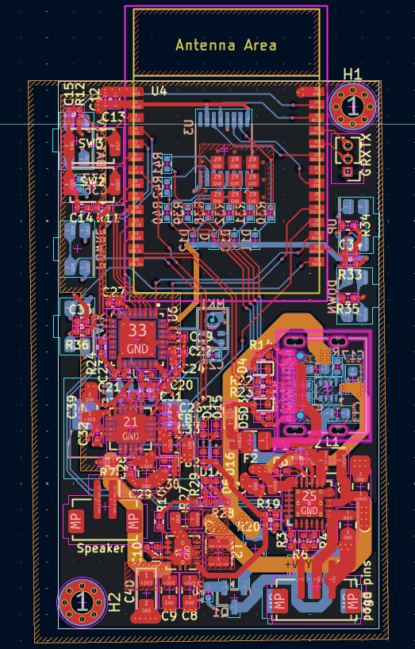

# Conversational-AI-Audio-Guide-Handset

Hardware design for a Wi-Fi connected, screen-free handset that lets a museum visitor hold a conversation with an on-site AI guide — speaking into it and listening through it like a telephone receiver. The handset is a smart audio endpoint only: it captures and cleans the visitor's voice, streams it to an edge AI server over Wi-Fi, and plays back the synthesized reply. All conversational AI, speech recognition, and speech synthesis run on the edge server, not on the handset.

> Designed against a client hardware requirements brief. Product/company-specific details have been generalized here for confidentiality.

## Highlights

- ESP32-C5 compute/connectivity platform — dual-band (2.4/5 GHz) Wi-Fi 6, no cellular
- Hardware-accelerated audio pipeline: echo cancellation, noise suppression, and voice-activity detection run in the codec's embedded DSP, not on the MCU
- Dual-input charging: cradle pogo-pin contacts (fleet charging) + USB-C service port, auto-arbitrated in hardware
- ~12-hour runtime target on a single 1S Li-Po cell, sized from a mission-profile power budget
- 8-LED status/battery UI driven off a single shift register to conserve GPIOs
- Designed for low-volume-first manufacturing, with BOM cost modeled at 50 / 100 / 500 units

## System Architecture

```
Visitor speech
      │
      ▼
 MEMS mic (x2) ──► Audio codec + embedded miniDSP ──► ESP32-C5 ──► Wi-Fi ──► Edge AI server
                    (AEC / noise suppression / VAD)      │                     (ASR, LLM, TTS)
                                                          │
 Earpiece ◄── Class-D amplifier ◄── Audio codec DAC ◄── ESP32-C5 ◄── Wi-Fi ◄──────┘
```

The handset does no AI inference — all compute-heavy work (speech recognition, the conversation model, speech synthesis) is offloaded to the edge server. This keeps the handset light, low-power, and low-cost.

## Schematic & PCB

### Schematics
<br>

*Page 1: Top-Level Hierarchy.*
<br>


*Page 2: Power & Battery Management.*
<br>


*Page 3: Microcontroller & User Interface.*
<br>


*Page 4: Audio System.*

---

### PCB Layout


*Full PCB layout*

## Power Subsystem

| Component | Role |
|---|---|
| AO3401A | Reverse-polarity protection on the cradle pogo-pin input |
| TPS2116DRL | 2:1 auto-switching power mux — merges cradle and USB-C 5V inputs onto one rail, auto-selects by priority |
| BQ25601 | NVDC Li-Po charger — JEITA/NTC thermal profiling, I2C status/fault reporting, BATFET ship-mode for shipping/storage isolation |
| TPS63001 | Buck-boost regulator — holds a constant 3.3V system rail across the full battery discharge curve (2.5–4.2V) |

**Battery sizing:** a mission-profile power budget was built across four operating states (idle/connected, active listening, active playback, Wi-Fi roaming transients), weighted by time-in-state and datasheet current draw. This gave an average battery current of ~110–135 mA, sized against a 12-hour runtime target (92% usable DoD, 80% end-of-life ageing margin) to a **1.8–2.0 Ah** cell, charging at ~0.6–0.8 A for a 3–3.5 hour recharge.

## Audio Subsystem

- **Codec:** stereo audio codec with an embedded, programmable miniDSP that runs acoustic echo cancellation, noise suppression, and voice-activity detection on-chip — offloading this from the ESP32-C5, whose RISC-V core lacks vector/DSP extensions.
- **Microphones:** dual digital MEMS mic array (primary on the main PCB, a second on a satellite PCB elsewhere in the enclosure) feeding the codec's digital mic bus as a pair, giving the DSP a spatially-separated reference for far-field noise cancellation.
- **Amplifier:** Class-D amplifier driving a single 8Ω earpiece channel at 88–94 dB SPL, meeting hearing-aid-compatibility loudness targets, with the unused channel held in shutdown.

## UI: Status LEDs & Buttons

- 8 indicator LEDs (4 battery-level + 4 device-status: ready / listening / thinking / offline) are all driven from a single shift register over 3 GPIO lines (data/clock/latch), rather than 8 dedicated GPIOs.
- Battery-level LEDs double as a charge indicator (blinking while charging, lit count showing charge level) and stay off otherwise, woken on demand by a dedicated button.
- Volume up/down is resolved on a single shared ADC input via a resistor-divider network — each button pulls the node to a distinct voltage band.

## Manufacturing

A preliminary Bill of Materials cost analysis was prepared at 50, 100, and 500-unit production volumes, in line with a low-volume-first sourcing strategy (dual-sourced parts, avoiding long lead-time/single-source components).

## Key Components

| Subsystem | Part |
|---|---|
| MCU / connectivity | ESP32-C5 |
| Audio codec / DSP | TLV320AIC3254 |
| Audio amplifier | TPA2012D2 |
| Battery charger | BQ25601 |
| Power mux | TPS2116DRL |
| Buck-boost regulator | TPS63001 |
| Reverse-polarity protection | AO3401A |
| LED driver | 74HC595 shift register |
